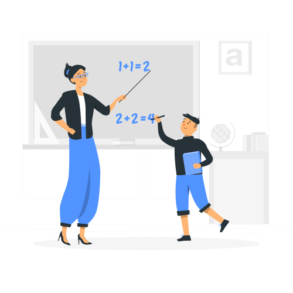
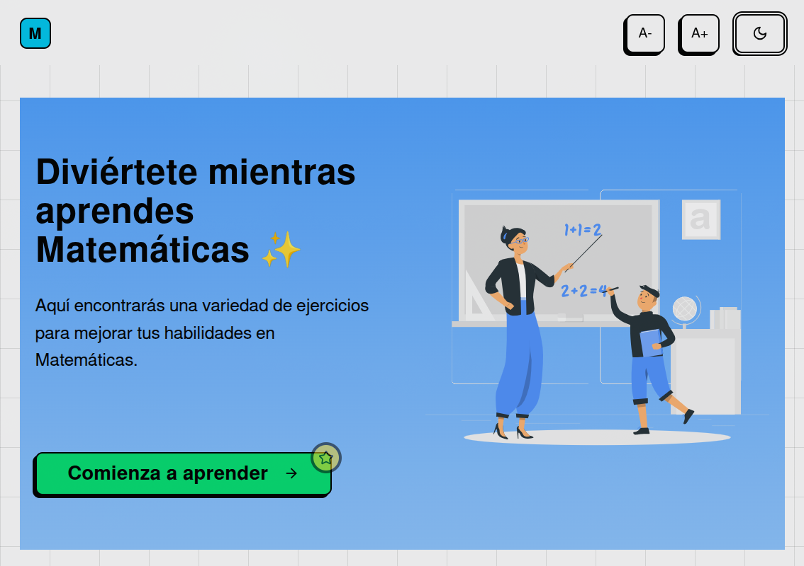
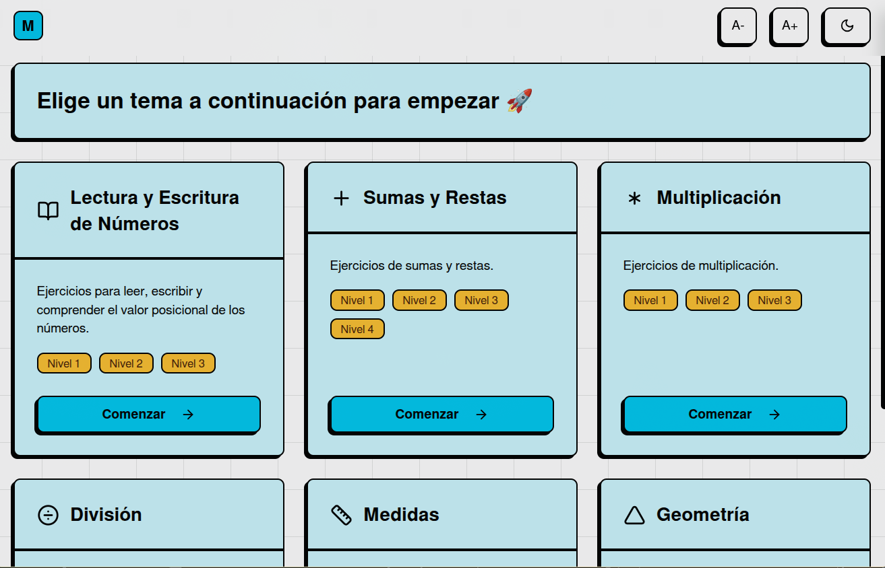
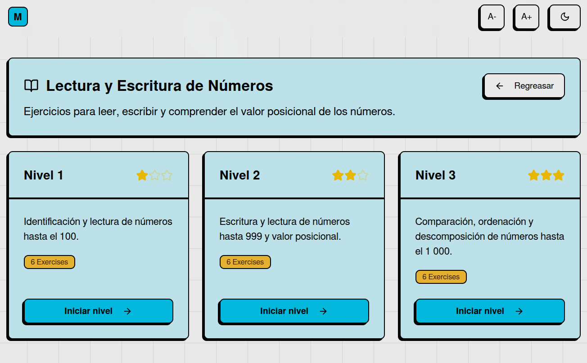
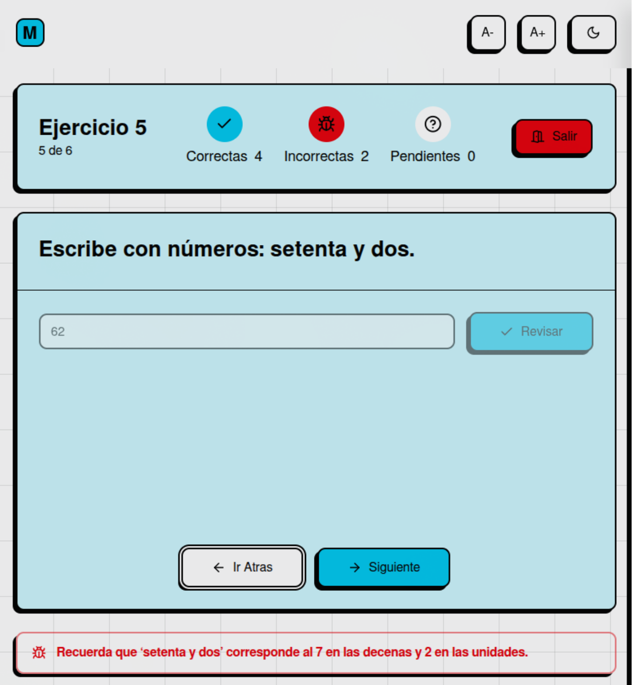
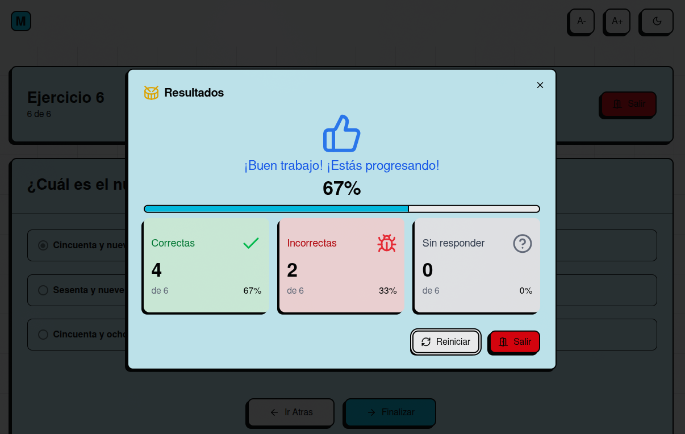

# 🧮 Math3 - Plataforma Educativa de Matemáticas

<div align="center">



**Una plataforma interactiva para aprender matemáticas de forma divertida y efectiva**

[](https://math3-eight.vercel.app/)
[](https://reactjs.org/)
[](https://www.typescriptlang.org/)
[](https://tailwindcss.com/)[](https://zustand.dev/)[](https://tanstack.com/router)

</div>

## ✨ Características Principales

- 🎯 **Ejercicios Interactivos**: Múltiples tipos de ejercicios adaptados a diferentes niveles
- 🎨 **Interfaz Moderna**: Diseño atractivo y responsive con modo oscuro/claro
- 🔊 **Feedback Auditivo**: Sonidos de retroalimentación para una experiencia inmersiva
- 🎉 **Celebraciones**: Animaciones de confetti al completar niveles
- 📊 **Seguimiento de Progreso**: Sistema de niveles y estadísticas detalladas
- ♿ **Accesibilidad**: Ajuste de tamaño de fuente y navegación por teclado

## 🛠️ Tecnologías Utilizadas

### Frontend
- **React 19.0.0** - Biblioteca de interfaz de usuario
- **TypeScript 5.7.2** - Tipado estático
- **TanStack Router** - Enrutamiento moderno
- **Tailwind CSS 4.0.6** - Framework de estilos
- **Zustand 5.0.4** - Gestión de estado

### UI/UX
- **Radix UI** - Componentes accesibles
- **Lucide React** - Iconos modernos
- **Canvas Confetti** - Animaciones de celebración
- **use-sound** - Efectos de sonido
- **Sonner** - Notificaciones elegantes

### Herramientas de Desarrollo
- **Vite 6.1.0** - Build tool y dev server
- **ESLint & Prettier** - Linting y formateo

## 🚀 Instalación y Desarrollo

### Prerrequisitos
- Node.js 18+ o Bun
- Git

### Instalación

```bash
# Clonar el repositorio
git clone https://github.com/tu-usuario/math3.git
cd math3

# Instalar dependencias
bun install
# o
npm install

# Iniciar servidor de desarrollo
bun run dev
# o
npm run dev
```

### Scripts Disponibles

```bash
# Desarrollo
bun run dev          # Inicia el servidor en puerto 3001
bun run start        # Alias para dev

# Producción
bun run build        # Construye la aplicación
bun run serve        # Previsualiza el build
```

## 🏗️ Arquitectura del Proyecto

```
src/
├── assets/           # Recursos estáticos
│   ├── images/      # Capturas de pantalla
│   └── sounds/      # Efectos de audio
├── components/       # Componentes React
│   ├── ui/          # Componentes base (shadcn/ui)
│   └── layout/      # Componentes de layout
├── lib/             # Utilidades y configuración
│   ├── data/        # Datos de ejercicios y temas
│   ├── hooks/       # Hooks personalizados
│   └── providers/   # Proveedores de contexto
└── routes/          # Rutas de la aplicación
    └── exercises/   # Páginas de ejercicios
```

## 🤝 Contribuir

¡Las contribuciones son bienvenidas! Por favor:

1. Fork el proyecto
2. Crea una rama para tu feature (`git checkout -b feature/AmazingFeature`)
3. Commit tus cambios (`git commit -m 'Add some AmazingFeature'`)
4. Push a la rama (`git push origin feature/AmazingFeature`)
5. Abre un Pull Request

## 📸 Capturas de Pantalla

<div align="center">

### 🏠 Página Principal


### 📚 Temas Disponibles


### 📈 Niveles por Tema


### 🎯 Ejercicio Incorrecto


### 🏆 Resultados del Nivel


</div>


---

<div align="center">

**¡Hecho con ❤️ para hacer las matemáticas más divertidas!**

[🌐 Ver Demo](https://math3-eight.vercel.app/) • [📧 Contacto](mailto:yanieltm861@gmail.com) • [🐛 Reportar Bug](https://github.com/yanieltm99/math3/issues)

</div>
